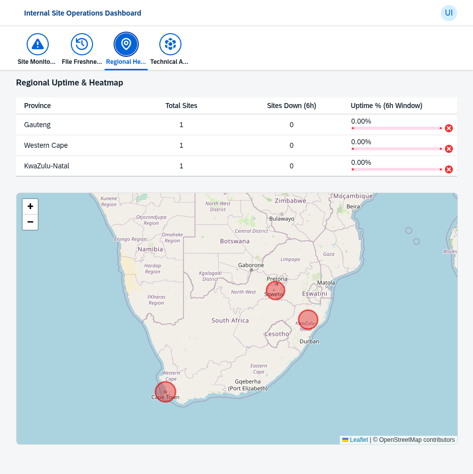
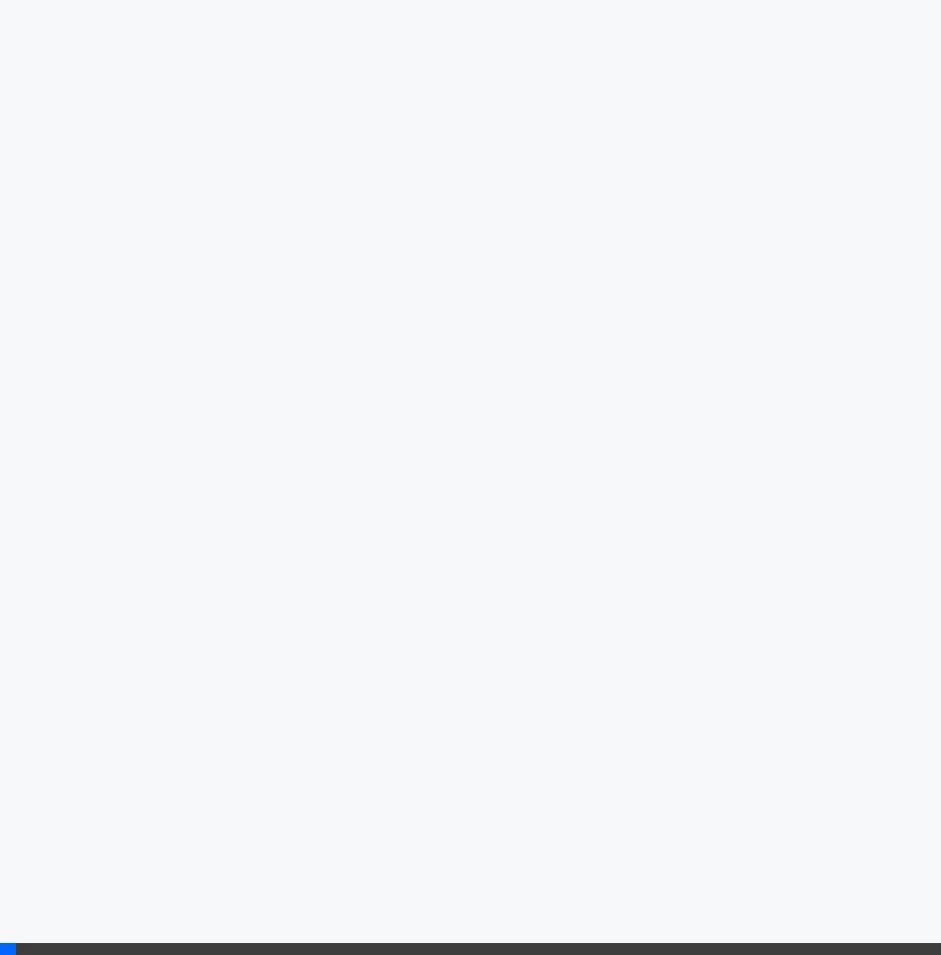

# Walkthrough: Dashboard Visualizations & Refinements

I have refined the `sites_down` dashboard and successfully pushed the project to GitHub and deployed it to SAP BTP Cloud Foundry.

## 1. Sites Currently Down (>6 Hours)
The visibility of the data cards was restored by fixing the backend RPC name and adjusting the OData metadata types to ensure stable parsing in the UI.

- **Status**: Visualized when sites meet the downtime criteria.
- **Icon**: Updated to `sap-icon://monitor`.

## 2. Updated Tab Icons
To improve navigation, I've updated the tab filters with more appropriate icons:
- **File Freshness**: Updated to `sap-icon://history` (Clock with arrow).
- **Regional Health**: Kept as `sap-icon://map`.

## 3. Interactive Geographic Map (Regional Health)
Since the standard `sap.ui.vbm` library was unavailable on the CDN, I implemented a robust fallback using **Leaflet**.
- **Heatmap**: Colored markers (circles) represent provincial health (uptime).
- **Interactivity**: Clicking a marker provides a popup with detailed uptime percentage.
- **South Africa Focus**: The map is automatically centered on South Africa.

## 4. GitHub Repository
The project has been initialized as a git repository and pushed to GitHub.
- **URL**: [sladerose/ExternalCA](https://github.com/sladerose/ExternalCA)

## 5. Cloud Foundry Deployment
The application has been built and deployed to your Cloud Foundry space (`dev`).
- **MTA ID**: `externalca`
- **Application URL**: [externalca-approuter](https://ath-internal-eu-development-dev-externalca-approuter.cfapps.eu10-004.hana.ondemand.com)
- **Status**: Active

````carousel

<!-- slide -->

````

## Summary of Changes
- **Backend**: Corrected RPC function call and refined OData entity key types.
- **Frontend**: Integrated Leaflet for geographic visualization, fixed SVG icon loading errors, and refined card bindings.
- **Verification**: Confirmed stable rendering and data integrity across all tabs.
